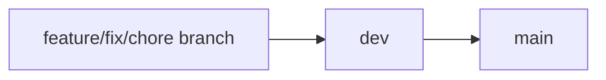

# Contributing to Employee Dashboard Repo

---

Conventions for everyone working in this repo. Pair this with [README.md](README.md) for setup, project structure, API/auth model, and testing commands — those aren't repeated here.

---

## Commit Formatting
Please use the formatting standards below for all commit messages. It makes it easier for everyone to understand and for PRs to be reviewed

---

### CONVENTIONAL COMMITS

| Prefix | Description |
|---|---|
| `feat:` | a new feature |
| `fix:` | a bug fix |
| `chore:` | maintenance, config, tooling (no production code change) |
| `docs:` | documentation only |
| `refactor:` | code change that isn't a fix or feature |
| `test:` | adding or updating tests |

### EXAMPLES

| Prefix | Example |
|---|---|
| `feat:` | add GitHub SSO auth endpoint |
| `fix:` | correct JWT expiration handling |
| `chore:` | add Cypress to dev environment |
| `docs:` | update README with Docker setup instructions |
| `test:` | add e2e auth flow tests |

---

## Branch Naming

Branch from `dev`. Use a prefix that matches your commit type:

| Prefix | Use for | Example |
|---|---|---|
| `feature/` | New functionality | `feature/github-org-check` |
| `fix/` | Bug fixes | `fix/jwt-expiration` |
| `chore/` | Tooling, config, deps | `chore/cypress-profile` |
| `docs/` | Documentation only | `docs/contributing-guide` |
| `test/` | Test-only changes | `test/auth-e2e-cookies` |
| `refactor/` | Non-feature code changes | `refactor/auth-helpers` |

Keep branch names short, lowercase, and hyphen-separated.

---

## Git Workflow

- Never push directly to `main` or `dev`
- Always branch from the latest `dev`:

  ```bash
  git checkout dev
  git pull origin dev
  git checkout -b feature/your-feature
  ```

- Open a PR into `dev` when your work is ready for review
- Keep PRs focused — one logical change per PR; avoid unrelated refactors or drive-by fixes
- Rebase or merge `dev` into your branch if it has fallen behind before requesting review

### dev → main

`main` is the stable branch. Changes land on `main` only via PR from `dev`, after `dev` has been tested and reviewed as a release candidate. Do not branch from `main` for day-to-day feature work.



Hotfixes that cannot wait for the normal `dev` cycle: branch from `main` as `fix/...`, PR into `main`, then back-merge into `dev` so the branches stay aligned.

---

## Pull Requests

### Title

Use the same conventional prefix as commits:

- `feat: add GitHub org membership check`
- `fix: correct JWT expiration handling`

### Description

Include:

- **What** changed and **why**
- **How to test** (commands, URLs, curl examples)
- **Screenshots** for UI changes
- **Migration notes** if Django models changed
- **Known limitations** or follow-up work, if any

### Review

- Request review from at least one other team member before merging
- Address or reply to all review comments
- Do not merge your own PR without a review unless explicitly agreed for urgent hotfixes

---

## Before You Open a PR

Run through this checklist locally:

- [ ] Branch is up to date with `dev`
- [ ] Commit messages follow [Conventional Commits](#conventional-commits)
- [ ] No secrets committed (`.env`, `client/.env.local`, tokens, keys) — use `.env.example` / `client/.env.local.example` as templates only
- [ ] Frontend lint passes:

  ```bash
  cd client && npm run lint
  ```

- [ ] App starts and your change works (`docker compose -f docker-compose.dev.yaml up --build` — see [README Getting Started](README.md#getting-started))
- [ ] Django migrations are committed if models changed:

  ```bash
  docker exec -it dashserver-container python manage.py makemigrations
  docker exec -it dashserver-container python manage.py migrate
  ```

- [ ] Cypress tests updated if you touched auth, routes, or API paths (see [README Testing](README.md#testing))
- [ ] README or API docs updated if behavior, env vars, or endpoints changed

---

## Code Conventions

### Frontend (`client/`)

- Auth uses **HttpOnly cookies** (`access_token`, `refresh_token`) — not `localStorage`
- API calls go through `client/src/api/axios.js` with credentials enabled
- Protected routes live behind the router setup in `client/router.jsx`
- Run `npm run lint` before opening a PR

### Backend (`server/`)

- API routes are under `/api/v1/` (see [README API Reference](README.md#api-reference))
- Auth logic belongs in `user_app/` unless a new Django app is warranted
- Always commit migration files with model changes; do not edit migrations that have already been applied on shared branches
- Do not commit `local_settings.py`, `.env`, or database files

### API changes

- Prefer additive changes (new fields/endpoints) over breaking changes
- If an endpoint contract changes, update the README API table and note it in the PR description

---

## Secrets and Environment Files

| File | Commit? | Notes |
|---|---|---|
| `.env.example` | Yes | Template only — no real secrets |
| `client/.env.local.example` | Yes | Template only |
| `.env` | **Never** | Root Django/Docker config |
| `client/.env.local` | **Never** | Frontend API URL and GitHub client ID |

If you accidentally commit a secret, rotate it immediately and do not rely on a follow-up commit to "remove" it from git history.
