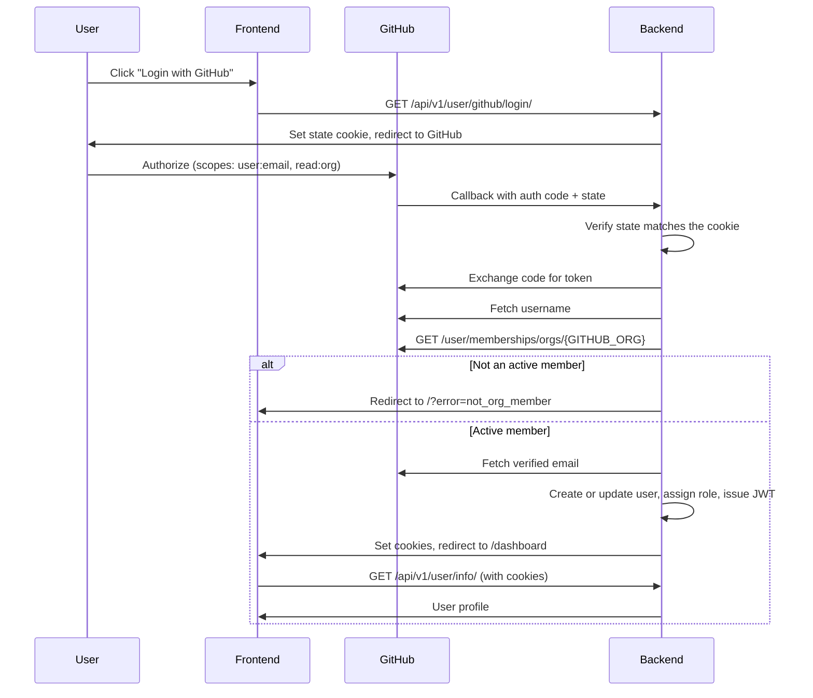

# Employee Dashboard
### Mystic Die Studios internal employee portal


The Employee Dashboard is Mystic Die Studios' internal portal for employees. It centralizes authentication and will eventually host documentation and other internal tools. The project is in early development — the auth flow is functional, and the dashboard is a minimal shell with more features planned.

---

## Table of Contents

- [Employee Dashboard](#employee-dashboard)
    - [Mystic Die Studios internal employee portal](#mystic-die-studios-internal-employee-portal)
  - [Table of Contents](#table-of-contents)
  - [Features](#features)
  - [Tech Stack](#tech-stack)
  - [Project Structure](#project-structure)
  - [Getting Started](#getting-started)
    - [Prerequisites](#prerequisites)
    - [Setup](#setup)
    - [Manual setup (without Docker)](#manual-setup-without-docker)
  - [Environment Variables](#environment-variables)
  - [API Reference](#api-reference)
    - [Authentication flow](#authentication-flow)
  - [Admin Workflow](#admin-workflow)
  - [Employee Workflow](#employee-workflow)
  - [GitHub OAuth App](#github-oauth-app)
  - [Working against the deployed site](#working-against-the-deployed-site)
  - [Deploying to cPanel](#deploying-to-cpanel)
  - [Testing](#testing)
  - [Future Work](#future-work)

---

## Features

**Authentication**
- **GitHub OAuth login** — Employees sign in with GitHub (`user:email` scope); the backend exchanges the OAuth code and fetches the verified email and username
- **JWT cookie auth** — Access and refresh tokens are stored in HttpOnly cookies (`access_token`, `refresh_token`) via SimpleJWT
- **Admin login** — Admins can authenticate with email and password through the API
- **Role-based users** — Users are assigned an `admin` or `employee` role
- **Token refresh** — Expired access tokens can be refreshed using the refresh cookie

**Dashboard**
- **Main Hub** — Will be the source of announcements and other important info as well as where users navigate to other features based on their auth level
- **Protected route** — `/dashboard` requires an authenticated session; unauthenticated users are redirected to `/`
- **Welcome view** — Displays a personalized greeting using the user's GitHub username
- **Logout** — Clears auth cookies and returns the user to the login page


**Planned (not yet implemented)**
- Employee create/login/logout endpoints (stubbed in the backend, just need copy paste from admin and role adjustments)
- GitHub org membership validation before user creation (Drop-in location indicated in GitHub callback view)
- `documentation_app` — internal documentation and resource features

---

## Tech Stack

| Layer | Technology |
|---|---|
| Frontend | React 19, Vite 8, React Router 7, Tailwind CSS 4 |
| HTTP | Axios (cookie credentials) |
| Backend | Django 5.2, Django REST Framework |
| Auth | SimpleJWT (cookie-based) |
| OAuth | GitHub OAuth |
| Database | MySQL 8.0 |
| Testing | Cypress 15 |
| Containerization | Docker Compose |

---

## Project Structure

```
employee-dashboard/
├── client/                   # React frontend (Vite)
├── server/                   # Django backend
│   ├── user_app/             # Auth + user model
│   ├── documentation_app/    # Scaffold (future docs)
│   └── passenger_wsgi.py     # cPanel/Passenger entrypoint
├── deploy/
│   ├── cpanel_deploy.sh      # Build, migrate, restart on the host
│   └── env.production.example
├── .cpanel.yml               # cPanel Git Version Control deploy hook
├── docker-compose.dev.yaml   # Dev orchestration (use this)
├── docker-compose.yaml       # Legacy/broken — references ./frontend
├── .env.example
├── CONTRIBUTING.md
└── README.md
```

---

## Getting Started

### Prerequisites

- [Docker](https://docs.docker.com/get-docker/) and Docker Compose installed
- A [GitHub OAuth App](https://github.com/settings/developers) with callback URL:
  `http://localhost:8000/api/v1/user/github/callback/`

### Setup

1. **Clone the repository**
   ```bash
   git clone https://github.com/Mystic-Die-Studios/employee-dashboard.git
   cd employee-dashboard
   ```

2. **Create your environment files**

   In the project root:
   ```bash
   cp .env.example .env
   ```

   Also create a `.env.local` file inside the `client/` directory:
   ```bash
   cp client/.env.local.example client/.env.local
   ```

   Fill in the values in both files — see [Environment Variables](#environment-variables) below.

3. **Start the application**
   ```bash
   docker compose -f docker-compose.dev.yaml up --build
   ```

   This spins up the Django backend, MySQL database, and Vite frontend.

   > **Note:** Use `docker-compose.dev.yaml`, not `docker-compose.yaml`. The latter references a non-existent `./frontend` directory.

4. **Run migrations** (first run only)
   ```bash
   docker exec -it dashserver-container python manage.py migrate
   ```

5. **Create an admin** (optional)

   ```bash
   curl -X POST http://localhost:8000/api/v1/user/create/admin/ \
     -H "Content-Type: application/json" \
     -d '{"email": "admin@example.com", "password": "your-password"}'
   ```

6. **Access the app**

   Open your browser and navigate to `http://localhost:5173`.

### Manual setup (without Docker)

**Backend:**
```bash
cd server
pip install -r requirements.txt
python manage.py migrate
python manage.py runserver
```

**Frontend:**
```bash
cd client
npm install
npm run dev
```

---

## Environment Variables

Copy `.env.example` to `.env` and fill in the following:

| Variable | Description |
|---|---|
| `DJANGO_KEY` | Django secret key — generate one at [djecrety.ir](https://djecrety.ir) or use `python -c "from django.core.management.utils import get_random_secret_key; print(get_random_secret_key())"` |
| `DEBUG` | `True` for local development, `False` in production |
| `ALLOWED_HOSTS` | Comma-separated list of allowed hosts (e.g. `localhost,127.0.0.1`) |
| `CORS_ALLOWED_ORIGINS` | Comma-separated list of allowed origins (e.g. `http://localhost:5173`) |
| `CORS_ALLOW_CREDENTIALS` | Must be `true` for cookie-based auth to work |
| `DB_NAME` | MySQL database name |
| `DB_USER` | MySQL username |
| `DB_PASSWORD` | MySQL password |
| `DB_HOST` | Database host (use `db` when running via Docker Compose) |
| `DB_PORT` | Database port (default `3306`) |
| `MYSQL_DATABASE` | Docker MySQL service database name (must match `DB_NAME`) |
| `MYSQL_USER` | Docker MySQL service username (must match `DB_USER`) |
| `MYSQL_PASSWORD` | Docker MySQL service password (must match `DB_PASSWORD`) |
| `MYSQL_ROOT_PASSWORD` | Docker MySQL root password |
| `GITHUB_CLIENT_ID` | GitHub OAuth app client ID |
| `GITHUB_CLIENT_SECRET` | GitHub OAuth app client secret |
| `GITHUB_REDIRECT_URI` | Must match the OAuth app's **Authorization callback URL** exactly. Leave blank to derive it from the incoming request |
| `GITHUB_ORG` | Org a user must belong to in order to sign in (default `Mystic-Die-Studios`) |
| `ADMIN_GITHUB_USERNAMES` | Comma-separated GitHub usernames granted the `admin` role on login |
| `FRONTEND_URL` | Where the callback sends the browser after success or failure (default `http://localhost:5173`) |
| `SESSION_COOKIE_SECURE` | `False` for local http dev, `True` in production — browsers drop `Secure` cookies over plain http |
| `AUTH_COOKIE_SAMESITE` | `Lax` by default. Use `None` (with `SESSION_COOKIE_SECURE=True`) if the frontend and API are on different registrable domains |
| `CSRF_TRUSTED_ORIGINS` | Defaults to `CORS_ALLOWED_ORIGINS` |
| `TRUST_PROXY_SSL_HEADER` | Trust `X-Forwarded-Proto`. Required behind cPanel/Apache, which terminates TLS. Defaults to on when `DEBUG=False` |
| `SECURE_SSL_REDIRECT` | Redirect http to https in Django. Off by default — usually handled by the host |
| `SECURE_HSTS_SECONDS` | `0` (off). Opt in only once https is confirmed; browsers cache it |
| `FRONTEND_DIST_DIR` | Override the location of the built React app. Auto-detected otherwise |

For production values see [`deploy/env.production.example`](deploy/env.production.example)
and [Deploying to cPanel](#deploying-to-cpanel).

> **Note:** `DB_*` and `MYSQL_*` values must align. Set `DB_HOST=db` when running with Docker Compose.

The frontend also requires its own `.env.local` file inside the `client/` directory:

| Variable | Description |
|---|---|
| `VITE_API_BASE_URL` | Backend URL (e.g. `http://localhost:8000`) |

> The client ID no longer needs to be exposed to the browser — the server owns the
> OAuth parameters and the frontend just links to `/api/v1/user/github/login/`.

---

## API Reference

All endpoints are prefixed with `/api/v1/`.

| Method | Path | Auth | Description |
|---|---|---|---|
| GET | `/test/` | None | Health check — returns `{"connected": true}` |
| GET | `/user/github/login/` | None | Starts OAuth: mints a CSRF `state` and redirects to GitHub |
| GET | `/user/github/callback/` | None | GitHub OAuth callback; verifies org membership, sets JWT cookies, redirects to `/dashboard` |
| POST | `/user/create/admin/` | None | Create an admin user |
| POST | `/user/admin/login/` | None | Admin email/password login |
| POST | `/user/logout/` | None | Clear auth cookies |
| POST | `/user/admin/logout/` | None | Alias of `/user/logout/` |
| GET | `/user/info/` | Cookie JWT | Returns current user profile |
| POST | `/user/token/refresh/` | Refresh cookie | Issue new access/refresh cookies |

The callback is reached by a top-level browser redirect, so it never answers with
JSON. Every failure sends the browser back to `FRONTEND_URL/?error=<code>`:

| Code | Meaning |
|---|---|
| `not_org_member` | Authenticated, but not an active member of `GITHUB_ORG` |
| `org_check_failed` | GitHub would not report membership — usually an org that has not approved this OAuth app |
| `github_denied` | User declined on GitHub's consent screen |
| `invalid_state` | Missing or mismatched `state` — a stale tab, or a forged callback |
| `no_verified_email` | No verified email address on the GitHub account |
| `token_exchange_failed` / `github_profile_failed` / `no_code` | GitHub handshake failed |

### Authentication flow



Membership is checked **before** any account is created, so a non-member never
gets a row in the database.

---

## Admin Workflow

Admin setup is done by hitting the API endpoints directly (e.g. via Postman or curl). There is no admin-facing UI yet.

1. **Create an admin** — `POST /api/v1/user/create/admin/` with `email`, `password`, and optional `username` / `github_username`
2. **Log in** — `POST /api/v1/user/admin/login/` with `email` and `password`
3. **Verify session** — `GET /api/v1/user/info/` returns the authenticated user's profile
4. **Log out** — `POST /api/v1/user/admin/logout/`

---

## Employee Workflow

1. Navigate to `http://localhost:5173`
2. Click **Login with GitHub**
3. Authorize the app on GitHub
4. After OAuth completes, you land on `/dashboard` — currently a placeholder landing page

Sign-in requires active membership of the org named by `GITHUB_ORG`; anyone else is
bounced back to the login page with an explanation. New users get the `employee`
role unless their GitHub username is listed in `ADMIN_GITHUB_USERNAMES`.

> **Note:** Employee-specific create/login endpoints are not wired up yet, and the
> dashboard itself is still a placeholder.

---

## GitHub OAuth App

One OAuth app, pointed at the deployed site. An OAuth app has exactly one
callback URL, so this app authorizes `dashboard.mysticdie.com` only — see
[Working against the deployed site](#working-against-the-deployed-site).

Create it under the **Mystic-Die-Studios organization**, not a personal account,
so it survives staff changes: **Organization → Settings → Developer settings →
OAuth Apps → New OAuth App**.

| Field | Value |
|---|---|
| Application name | `Employee Dashboard` |
| Homepage URL | `https://dashboard.mysticdie.com` |
| Authorization callback URL | `https://dashboard.mysticdie.com/api/v1/user/github/callback/` |

The callback URL must match `GITHUB_REDIRECT_URI` **character for character**,
including the trailing slash. A mismatch shows up as GitHub's own
`redirect_uri_mismatch` error page before the app is ever reached.

After creating the app, click **Generate a new client secret**. Copy the client
ID and the secret into the server `.env` — the secret is shown once, and GitHub
will not show it again.

> No scopes are set on the app itself; the server asks for `user:email` and
> `read:org` at authorization time.

### Approve the app for the organization

This step is easy to miss and produces the most confusing failure.

If the org has **third-party application access restrictions** enabled, GitHub
hides membership from the API until an org owner approves the app. Sign-in then
fails for genuine employees. The server reports this as `org_check_failed`
rather than "not a member" so it is distinguishable.

An org owner should go to **Organization → Settings → Third-party Access** and
grant access to the OAuth app. If you are an owner, the first sign-in attempt
will offer to request it.

---

## Working against the deployed site

`dashboard.mysticdie.com` doubles as the development environment: GitHub sign-in
only works where the OAuth callback points, and that is production.

The loop is push → deploy → reload:

```bash
git push origin dev
# then in cPanel: Git Version Control > Manage > Update from Remote > Deploy HEAD Commit
```

Or, from the cPanel Terminal, skipping the cPanel UI entirely:

```bash
cd ~/repositories/employee-dashboard && git pull && bash deploy/cpanel_deploy.sh
```

A few things to know about developing this way:

- **Leave `DEBUG=False`.** Turning it on would publish full tracebacks, settings
  and environment values to anyone who loads a broken page. Read
  `~/employee-dashboard/stderr.log` instead — Django's traceback goes there.
- **Everything else still runs locally.** `npm run dev`, the test suite, and any
  page that does not need a signed-in user work fine on your machine; only the
  GitHub round trip requires the deployed callback.
- **The tests do not need GitHub at all** — they mock it, so run them locally
  before pushing.

If you later want sign-in working on localhost too, create a *second* OAuth app
with the callback `http://localhost:8000/api/v1/user/github/callback/` and put
its credentials in the root `.env`. Nothing in the code needs to change.

---

## Deploying to cPanel

Target layout: React and Django both served from `dashboard.mysticdie.com`.
Django serves the API at `/api/v1/` and hands every other path to the React
shell. One origin means same-site cookies and no CORS in play.

Three directories are involved, and mixing them up is the most common way to get
stuck. cPanel creates the first and third; only the middle one is yours to fill.

```
~/dashboard.mysticdie.com/           document root — created with the domain
└── .htaccess                        Passenger config, written by cPanel

~/employee-dashboard/                app root — Passenger runs the code here
├── passenger_wsgi.py                \
├── manage.py                         |  copied from the repo by the
├── employeedash_server/              |  deploy script; do not edit in place
├── user_app/                        /
├── .env                             production secrets, never in git
├── frontend/                        built React app
└── staticfiles/                     collectstatic output (Django admin)

~/repositories/employee-dashboard/   git clone — staging area, never served
```

The clone is not the running site: `deploy/cpanel_deploy.sh` copies out of it
into the app root. Nothing is ever served straight from the clone, and the
document root holds no application code at all.

### 1. Create the subdomain

**cPanel → Domains → Create A New Domain.** Add `dashboard.mysticdie.com`.
Then **cPanel → SSL/TLS Status** and run **AutoSSL** so https works before you
send GitHub anywhere.

### 2. Create the database

**cPanel → MySQL Databases.** Create a database and a user, and grant the user
**All Privileges** on it. cPanel prefixes both with your account name
(e.g. `mysticd_dashboard`). Note the values for `.env`.

### 3. Create the Python app

**cPanel → Setup Python App → Create Application.**

| Field | Value |
|---|---|
| Python version | 3.11 or newer |
| Application root | `employee-dashboard` |
| Application URL | `dashboard.mysticdie.com` (root, no subpath) |
| Application startup file | `passenger_wsgi.py` |
| Application Entry point | `application` |

> Set the Application URL to the domain **root**. Mounting at `/api` would make
> Passenger strip that prefix before Django sees it, which breaks every route.

cPanel creates the virtualenv at `~/virtualenv/employee-dashboard/<version>/`.
Leave the app stopped for now.

### 4. Add the production `.env`

Fill in the six `# TODO` lines in `deploy/.env.production` (gitignored, already
has a generated `DJANGO_KEY`), then save it on the server as
`~/employee-dashboard/.env` — File Manager → *Settings → Show Hidden Files*, or
paste it in the Terminal. The template without secrets is
[`deploy/env.production.example`](deploy/env.production.example).

Put values straight after the `=`. A trailing `# comment` on a blank key is read
as the literal string `# comment`, not as empty.

The deploy script refuses to run without this file, and never overwrites it.

### 5a. Give the server read access to the repository

The repository is private, and cPanel's git cannot prompt for a password. Without
a key it fails with:

```
fatal: could not read Username for 'https://github.com': No such device or address
```

Generate a key on the server and register it with GitHub as a **deploy key** —
scoped to this one repository, rather than a token that can reach every repo the
account can see.

In **cPanel → Terminal**:

```bash
ssh-keygen -t ed25519 -C "cpanel-deploy-employee-dashboard" -f ~/.ssh/id_ed25519 -N ""
ssh-keyscan github.com >> ~/.ssh/known_hosts   # avoids a host-verification failure
cat ~/.ssh/id_ed25519.pub
```

No Terminal on your plan? **cPanel → SSH Access → Manage SSH Keys → Generate a
New Key** (leave the passphrase empty, keep the default `id_rsa` name), then
**View/Download** the public key.

Copy that public key into **GitHub → the repository → Settings → Deploy keys →
Add deploy key**. Title it after the server, and leave **Allow write access
unchecked** — deploys only ever read.

Confirm it works before going further:

```bash
ssh -T git@github.com
```

`Hi Mystic-Die-Studios/employee-dashboard! You've successfully authenticated, but
GitHub does not provide shell access.` is success — that message is not an error.

### 5b. Connect Git

**cPanel → Git Version Control → Create.**

| Field | Value |
|---|---|
| Clone a Repository | on |
| Clone URL | `git@github.com:Mystic-Die-Studios/employee-dashboard.git` |
| Repository Path | `repositories/employee-dashboard` |

> **Do not** set the Repository Path to `dashboard.mysticdie.com`. That is the
> document root, it already holds the Passenger `.htaccess`, and cPanel refuses
> to clone into a non-empty directory:
> *"You cannot use the ... directory because it already contains files."*
> The clone is a staging area, not the served site — see
> [the three directories](#deploying-to-cpanel) above.

Deployment is driven by [`.cpanel.yml`](.cpanel.yml), which runs
[`deploy/cpanel_deploy.sh`](deploy/cpanel_deploy.sh).

### 6. Deploy

**Git Version Control → Manage → Pull or Deploy → Update from Remote**, then
**Deploy HEAD Commit**. Or from the cPanel Terminal:

```bash
bash ~/repositories/employee-dashboard/deploy/cpanel_deploy.sh
```

The script copies the Django code, builds the frontend, installs dependencies,
runs migrations and `collectstatic`, and restarts Passenger by touching
`tmp/restart.txt`. It is safe to re-run.

> **Node on the host:** the script runs `npm run build` if npm is on `PATH`
> (check with `command -v npm`; cPanel's **Setup Node.js App** usually puts it
> there). If npm is missing, build locally with `npm run build` in `client/` and
> upload `client/dist/` into `~/employee-dashboard/frontend/` — the script keeps
> whatever is already deployed rather than failing.

### 7. Sign in

Open `https://dashboard.mysticdie.com` and click **Login with GitHub**. You
should land on the placeholder dashboard with your GitHub username and role.

If you get bounced back with `?error=...`, look the code up in
[the callback error table](#api-reference) or in
[Troubleshooting](#troubleshooting) below.

### Troubleshooting

| Symptom | Cause |
|---|---|
| Deploy appears to hang at "Building the frontend" | Cypress downloading its ~200 MB test binary. The script sets `CYPRESS_INSTALL_BINARY=0` to skip it; if running npm by hand, export that first |
| `ReferenceError: CustomEvent is not defined` from Vite | Node is older than 20.19. Create a Node 20/22 app in **Setup Node.js App** — the deploy script picks the newest qualifying runtime automatically |
| Git Version Control: "directory already contains files" | Repository Path is set to the document root. Use `repositories/employee-dashboard` |
| `could not read Username for 'https://github.com'` | Private repo over https, which cannot prompt for credentials. Use the SSH clone URL plus a deploy key ([step 5a](#5a-give-the-server-read-access-to-the-repository)) |
| `Host key verification failed` | Run `ssh-keyscan github.com >> ~/.ssh/known_hosts` |
| `Permission denied (publickey)` | The deploy key is not registered, or git is using a different key than the one you generated. Check with `ssh -T git@github.com` |
| Site root shows a cPanel placeholder page | A leftover `index.html` in `~/dashboard.mysticdie.com/` is being served ahead of the app. Rename or delete it — but keep `.htaccess` and `cgi-bin/` |
| 500 on every request | Check `~/employee-dashboard/stderr.log` and the Passenger log path shown in Setup Python App |
| "Frontend build not found" | Step 6 — no build in `~/employee-dashboard/frontend/` |
| Redirected to `/?error=org_check_failed` | The org has not approved the OAuth app — see [above](#approve-the-app-for-the-organization) |
| Redirected to `/?error=invalid_state` | Cookies are being dropped. Confirm https works and `SESSION_COOKIE_SECURE=True` |
| GitHub shows `redirect_uri_mismatch` | Callback URL and `GITHUB_REDIRECT_URI` differ |
| `DisallowedHost` | Add the domain to `ALLOWED_HOSTS` |
| Code deployed but unchanged in browser | Passenger did not restart: `touch ~/employee-dashboard/tmp/restart.txt` |

---

## Testing

Backend tests cover the OAuth callback, the org gate, and the session endpoints:

```bash
docker exec -it dashserver-container python manage.py test user_app
```

Cypress E2E tests live in `client/cypress/`.

**Local:**
```bash
cd client
npm run cy:open    # Interactive Cypress UI
npm run cy:run     # Headless run
```

**Docker** (testing profile):
```bash
docker compose -f docker-compose.dev.yaml --profile testing up
```

---

## Future Work

The following features are scoped but not yet implemented:

- **Real dashboard** — `/dashboard` is a placeholder landing page
- **Employee endpoints** — Create and login flows for employee-role users
- **`documentation_app`** — Internal documentation and resource features
- **Fix `docker-compose.yaml`** — Update `./frontend` references to `./client`
- **Production deployment** — Nginx reverse proxy, SSL, and CI/CD pipeline

---

*Built at Mystic Die Studios.*
