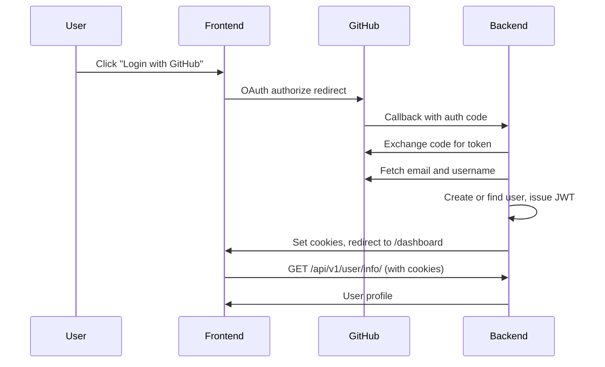

# Employee Dashboard
### Mystic Die Studios internal employee portal


The Employee Dashboard is Mystic Die Studios' internal portal for employees. It centralizes authentication and will eventually host documentation and other internal tools. The project is in early development — the auth flow is functional, and the dashboard is a minimal shell with more features planned.

---

## Table of Contents

- [Employee Dashboard](#employee-dashboard)
    - [Mystic Die Studios internal employee portal](#mystic-die-studios-internal-employee-portal)
  - [Table of Contents](#table-of-contents)
  - [Features](#features)
  - [Tech Stack](#tech-stack)
  - [Project Structure](#project-structure)
  - [Getting Started](#getting-started)
    - [Prerequisites](#prerequisites)
    - [Setup](#setup)
    - [Manual setup (without Docker)](#manual-setup-without-docker)
  - [Environment Variables](#environment-variables)
  - [API Reference](#api-reference)
    - [Authentication flow](#authentication-flow)
  - [Admin Workflow](#admin-workflow)
  - [Employee Workflow](#employee-workflow)
  - [Testing](#testing)
  - [Future Work](#future-work)

---

## Features

**Authentication**
- **GitHub OAuth login** — Employees sign in with GitHub (`user:email` scope); the backend exchanges the OAuth code and fetches the verified email and username
- **JWT cookie auth** — Access and refresh tokens are stored in HttpOnly cookies (`access_token`, `refresh_token`) via SimpleJWT
- **Admin login** — Admins can authenticate with email and password through the API
- **Role-based users** — Users are assigned an `admin` or `employee` role
- **Token refresh** — Expired access tokens can be refreshed using the refresh cookie

**Dashboard**
- **Main Hub** — Will be the source of announcements and other important info as well as where users navigate to other features based on their auth level
- **Protected route** — `/dashboard` requires an authenticated session; unauthenticated users are redirected to `/`
- **Welcome view** — Displays a personalized greeting using the user's GitHub username
- **Logout** — Clears auth cookies and returns the user to the login page


**Planned (not yet implemented)**
- Employee create/login/logout endpoints (stubbed in the backend, just need copy paste from admin and role adjustments)
- GitHub org membership validation before user creation (Drop-in location indicated in GitHub callback view)
- `documentation_app` — internal documentation and resource features

---

## Tech Stack

| Layer | Technology |
|---|---|
| Frontend | React 19, Vite 8, React Router 7, Tailwind CSS 4 |
| HTTP | Axios (cookie credentials) |
| Backend | Django 5.2, Django REST Framework |
| Auth | SimpleJWT (cookie-based) |
| OAuth | GitHub OAuth |
| Database | MySQL 8.0 |
| Testing | Cypress 15 |
| Containerization | Docker Compose |

---

## Project Structure

```
employee-dashboard/
├── client/                   # React frontend (Vite)
├── server/                   # Django backend
│   ├── user_app/             # Auth + user model
│   └── documentation_app/    # Scaffold (future docs)
├── docker-compose.dev.yaml   # Dev orchestration (use this)
├── docker-compose.yaml       # Legacy/broken — references ./frontend
├── .env.example
├── CONTRIBUTING.md
└── README.md
```

---

## Getting Started

### Prerequisites

- [Docker](https://docs.docker.com/get-docker/) and Docker Compose installed
- A [GitHub OAuth App](https://github.com/settings/developers) with callback URL:
  `http://localhost:8000/api/v1/user/github/callback/`

### Setup

1. **Clone the repository**
   ```bash
   git clone https://github.com/Mystic-Die-Studios/employee-dashboard.git
   cd employee-dashboard
   ```

2. **Create your environment files**

   In the project root:
   ```bash
   cp .env.example .env
   ```

   Also create a `.env.local` file inside the `client/` directory:
   ```bash
   cp client/.env.local.example client/.env.local
   ```

   Fill in the values in both files — see [Environment Variables](#environment-variables) below.

3. **Start the application**
   ```bash
   docker compose -f docker-compose.dev.yaml up --build
   ```

   This spins up the Django backend, MySQL database, and Vite frontend.

   > **Note:** Use `docker-compose.dev.yaml`, not `docker-compose.yaml`. The latter references a non-existent `./frontend` directory.

4. **Run migrations** (first run only)
   ```bash
   docker exec -it dashserver-container python manage.py migrate
   ```

5. **Create an admin** (optional)

   ```bash
   curl -X POST http://localhost:8000/api/v1/user/create/admin/ \
     -H "Content-Type: application/json" \
     -d '{"email": "admin@example.com", "password": "your-password"}'
   ```

6. **Access the app**

   Open your browser and navigate to `http://localhost:5173`.

### Manual setup (without Docker)

**Backend:**
```bash
cd server
pip install -r requirements.txt
python manage.py migrate
python manage.py runserver
```

**Frontend:**
```bash
cd client
npm install
npm run dev
```

---

## Environment Variables

Copy `.env.example` to `.env` and fill in the following:

| Variable | Description |
|---|---|
| `DJANGO_KEY` | Django secret key — generate one at [djecrety.ir](https://djecrety.ir) or use `python -c "from django.core.management.utils import get_random_secret_key; print(get_random_secret_key())"` |
| `DEBUG` | `True` for local development, `False` in production |
| `ALLOWED_HOSTS` | Comma-separated list of allowed hosts (e.g. `localhost,127.0.0.1`) |
| `CORS_ALLOWED_ORIGINS` | Comma-separated list of allowed origins (e.g. `http://localhost:5173`) |
| `CORS_ALLOW_CREDENTIALS` | Must be `true` for cookie-based auth to work |
| `DB_NAME` | MySQL database name |
| `DB_USER` | MySQL username |
| `DB_PASSWORD` | MySQL password |
| `DB_HOST` | Database host (use `db` when running via Docker Compose) |
| `DB_PORT` | Database port (default `3306`) |
| `MYSQL_DATABASE` | Docker MySQL service database name (must match `DB_NAME`) |
| `MYSQL_USER` | Docker MySQL service username (must match `DB_USER`) |
| `MYSQL_PASSWORD` | Docker MySQL service password (must match `DB_PASSWORD`) |
| `MYSQL_ROOT_PASSWORD` | Docker MySQL root password |
| `GITHUB_CLIENT_ID` | GitHub OAuth app client ID |
| `GITHUB_CLIENT_SECRET` | GitHub OAuth app client secret |
| `FRONTEND_URL` | OAuth redirect target (default `http://localhost:5173`) |

> **Note:** `DB_*` and `MYSQL_*` values must align. Set `DB_HOST=db` when running with Docker Compose.

The frontend also requires its own `.env.local` file inside the `client/` directory:

| Variable | Description |
|---|---|
| `VITE_API_BASE_URL` | Backend URL (e.g. `http://localhost:8000`) |
| `VITE_GITHUB_CLIENT_ID` | Same GitHub OAuth client ID as above — Vite requires the `VITE_` prefix to expose it to the browser |

---

## API Reference

All endpoints are prefixed with `/api/v1/`.

| Method | Path | Auth | Description |
|---|---|---|---|
| GET | `/test/` | None | Health check — returns `{"connected": true}` |
| GET | `/user/github/callback/` | None | GitHub OAuth callback; sets JWT cookies; redirects to `/dashboard` |
| POST | `/user/create/admin/` | None | Create an admin user |
| POST | `/user/admin/login/` | None | Admin email/password login |
| POST | `/user/admin/logout/` | Cookie JWT | Clear auth cookies |
| GET | `/user/info/` | Cookie JWT | Returns current user profile |
| POST | `/user/token/refresh/` | Refresh cookie | Issue new access/refresh cookies |

### Authentication flow



---

## Admin Workflow

Admin setup is done by hitting the API endpoints directly (e.g. via Postman or curl). There is no admin-facing UI yet.

1. **Create an admin** — `POST /api/v1/user/create/admin/` with `email`, `password`, and optional `username` / `github_username`
2. **Log in** — `POST /api/v1/user/admin/login/` with `email` and `password`
3. **Verify session** — `GET /api/v1/user/info/` returns the authenticated user's profile
4. **Log out** — `POST /api/v1/user/admin/logout/`

---

## Employee Workflow

1. Navigate to `http://localhost:5173`
2. Click **Login with GitHub**
3. Authorize the app on GitHub
4. After OAuth completes, you land on `/dashboard` with a personalized welcome message

> **Note:** Employee-specific create/login/logout endpoints are not wired up yet. New GitHub OAuth users are currently auto-assigned the `admin` role — this is temporary dev behavior and will change once org membership validation is implemented.

---

## Testing

Cypress E2E tests live in `client/cypress/`.

**Local:**
```bash
cd client
npm run cy:open    # Interactive Cypress UI
npm run cy:run     # Headless run
```

**Docker** (testing profile):
```bash
docker compose -f docker-compose.dev.yaml --profile testing up
```

> **Known issue:** The existing Cypress spec (`client/cypress/e2e/auth/login.cy.js`) is out of sync with the current app — it references `/login` instead of `/`, old API paths, and localStorage-based tokens instead of HttpOnly cookies. Updating these tests is tracked in [Future Work](#future-work).

---

## Future Work

The following features are scoped but not yet implemented:

- **GitHub org membership check** — Validate that OAuth users belong to the Mystic Die Studios GitHub org before creating accounts
- **Employee endpoints** — Create, login, and logout flows for employee-role users
- **`documentation_app`** — Internal documentation and resource features
- **Fix `docker-compose.yaml`** — Update `./frontend` references to `./client`
- **Sync `.env.example`** — Add `CORS_ALLOW_CREDENTIALS` and `FRONTEND_URL` to the template
- **Update Cypress tests** — Align specs with current routes, API paths, and cookie-based auth
- **Production deployment** — Nginx reverse proxy, SSL, and CI/CD pipeline

---

*Built at Mystic Die Studios.*
